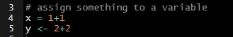
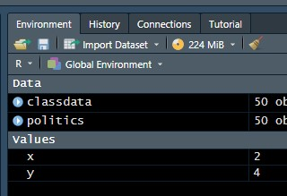
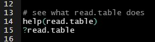
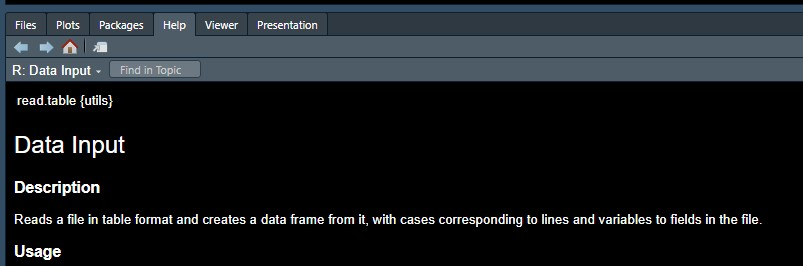
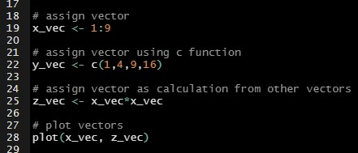
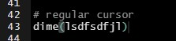
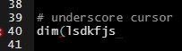

# R-cheatsheet
Personal cheat sheet of shortcuts, functions, tips, troubleshooting, etc. for using R/RStudio in Windows.

# Software
R -> https://cran.r-project.org/

RStudio -> https://www.rstudio.com/products/rstudio/download/#download

# Shortcuts
- Run script:   
```CTRL + ENTER```
- Insert assignment arrow:   
```ALT + -```

# Basics
## Assigning variables
To assign variables, use assignment arrow `->` (you can also use `=`, but arrow is preferred for assigning variables). After running script saved variable will appear in the Environment window.<br>

#### _Example_- Assigning Variable
<br>

#### _Example_- Viewing Saved Variables
<br>

## Help Function (View Documentation for Functions)
If you want to view documentation on a given function (thing), type `?thing` or `help(thing)` and run. The documentation will then appear in the Help tab of the bottom right window. <br>

#### _Example_- Help Function


#### _Example_- Help Documentation


## Vectors


# Troubleshooting
## Cursor Issue
Pressing `insert` will change your cursor from `|` to `_` and change the behavior of typing. When cursor is `_` closing parenthesis and brackets will no longer be added automatically which can be frustrating. To change back to the default cursor, press `insert`.<br>

#### _Example_- Regular Cursor


#### _Example_- Altered Cursor

